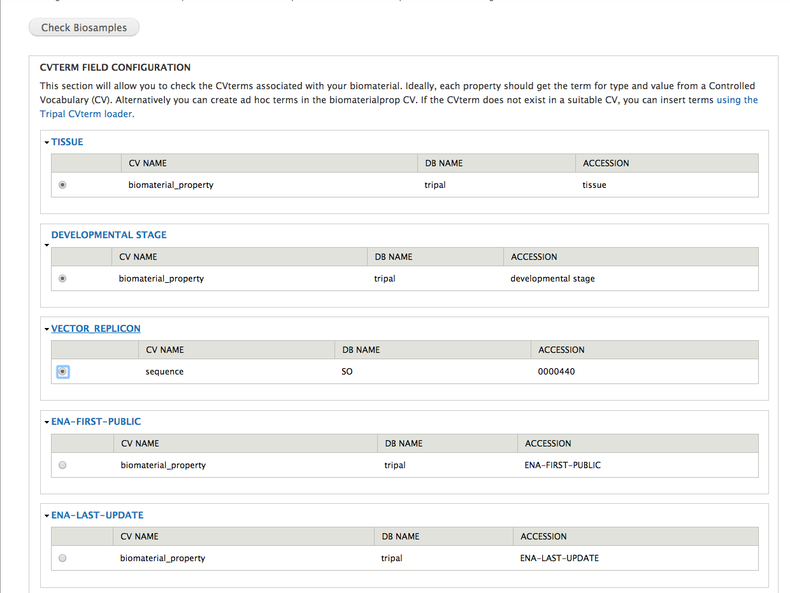
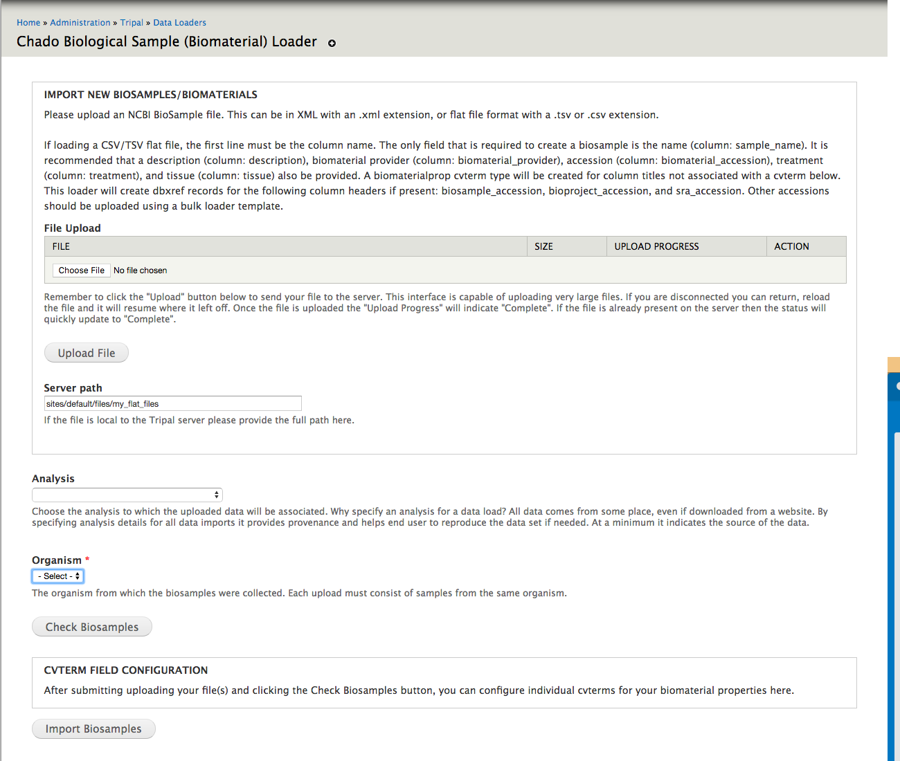
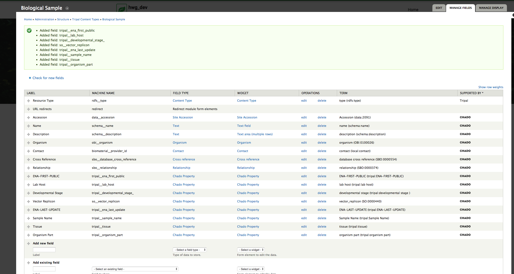
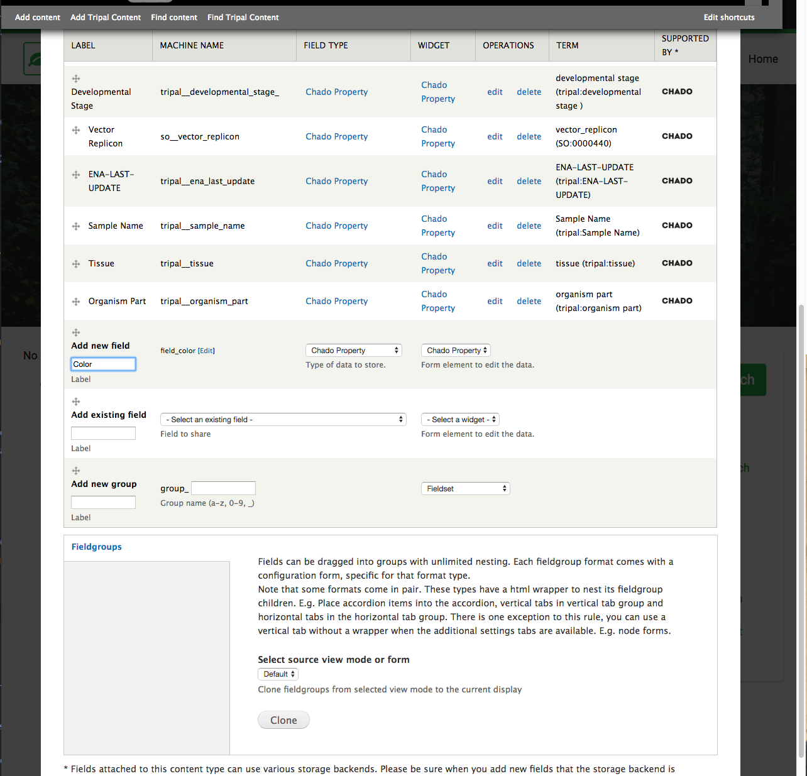
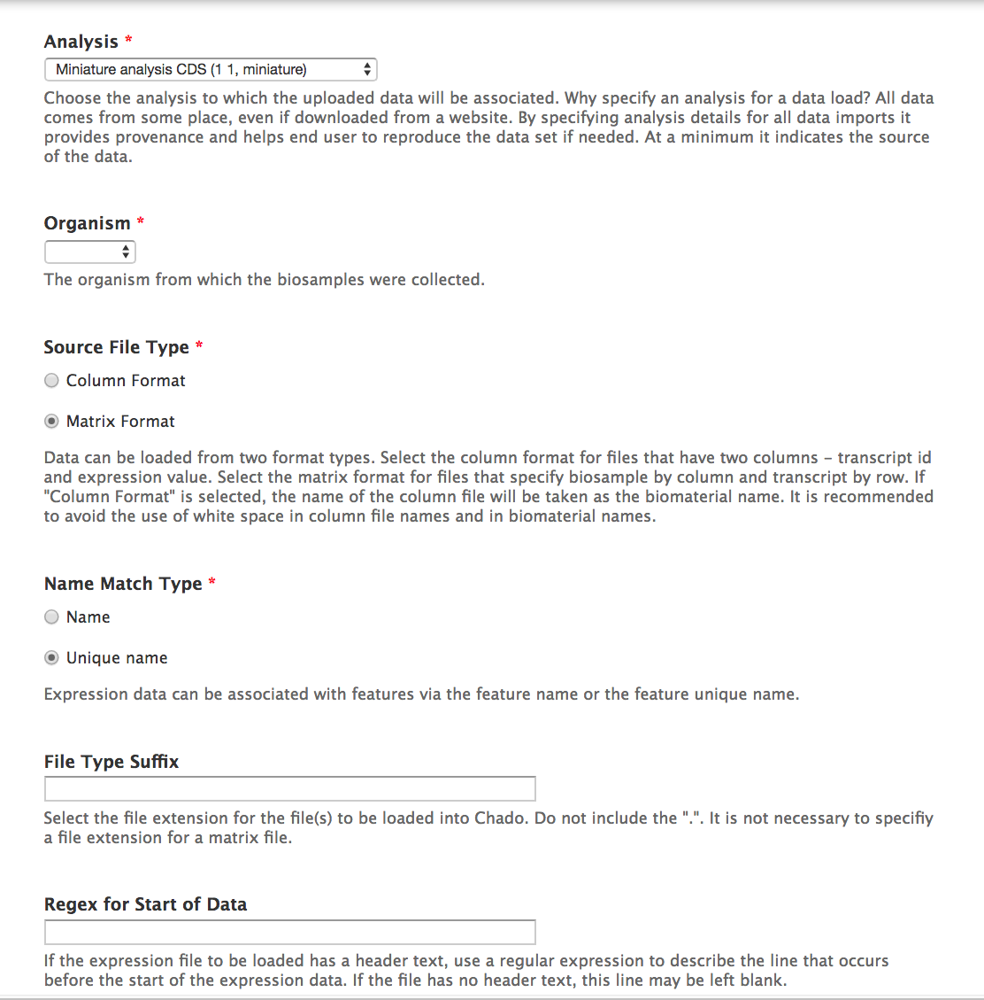
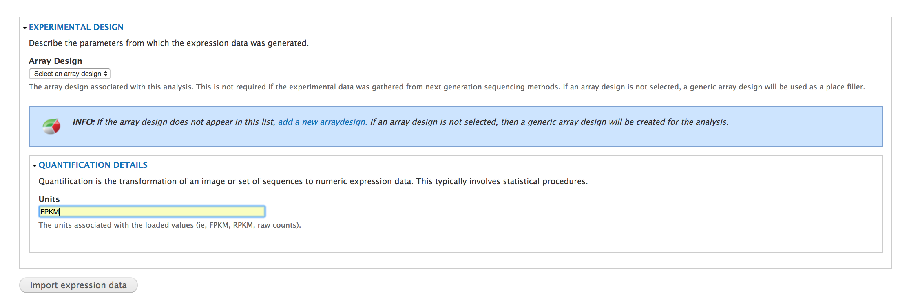
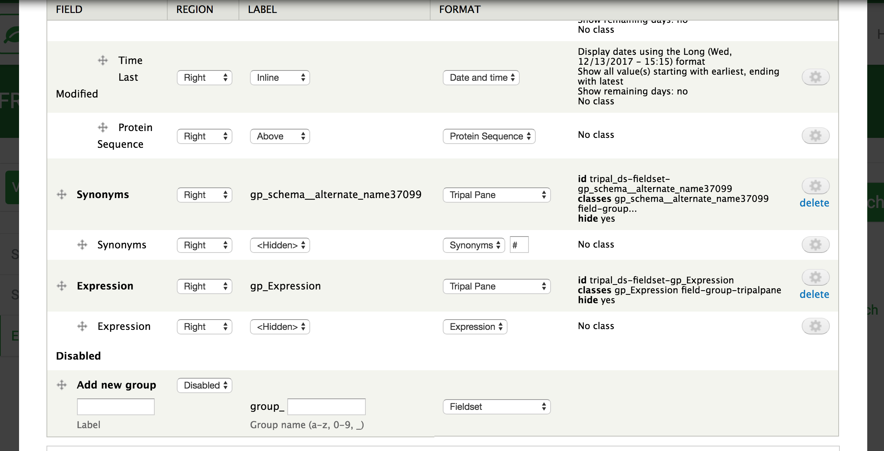
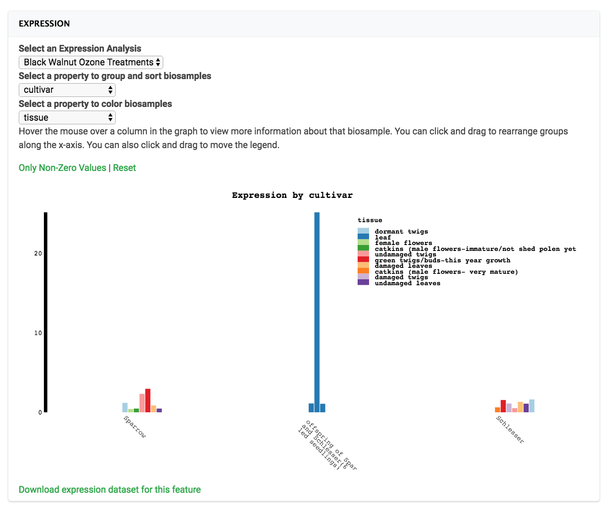

[](https://zenodo.org/badge/latestdoi/49081816)


# Tripal\_analysis\_expression

This is an extension module for the Tripal project. 

Please note this module requires **Tripal 3** or greater.  The [Tripal 2 functional module is available for download](https://github.com/tripal/tripal_analysis_expression/releases/tag/1.0.2) but is no longer supported.

# Tripal Analysis: Expression

1. [Introduction](#introduction)
2. [Installation](#installation)
3. [Module Features](#features)
4. [Loading Biosamples](#loading-biosamples)
5. [Loading Expression Data](#loading-expression-data)
6. [Viewing Data](#viewing-and-downloading-data)
7. [Administrative Pages](#administrative-pages)
8. [Protocols](#protocols)
9. [Example Files](#example-files)

# Introduction 
Tripal Analysis: Expression is a [Drupal](https://www.drupal.org/) module built to extend the functionality of the [Tripal](http://tripal.info/) toolset.
The purpose of the module is to visually represent gene expression for Tripal features. This module requires the following Tripal modules:

1. Tripal
2. Tripal Chado
3. Tripal Biomaterial (Included)


# Installation
1. Click on the green "Clone or download" button on the top right corner of this page to obtain the web URL. Download this module by running ```git clone <URL> ``` on command line. 
2. Place the cloned module folder "tripal_analysis_expression" inside your /sites/all/modules. Then enable the module by running ```drush en tripal_analysis_expression``` (for more instructions, read the [Drupal documentation page](https://www.drupal.org/node/120641)).

# Features
* Provides data loaders for biosamples and expression data
* Controlled Vocabulary tools for biosamples
* Visualization for expression data for individual features
* Heatmap tool to visualize multiple features

### Data Loaders
Two loaders are provided by this module, a biosample loader, and an expression loader. The biosample loader has the ability to load data from a flat file or from an xml file downloaded from NCBI. The expression loader can load expression data in column or matrix format.

### Expression Display
Once expression data is loaded, a display field will be shown on each feature page that has corresponding biosamples and expression values.

### Heatmap
This module provides a search and results block to search for and select features to display in a heatmap.


## Tripal 3 entities and fields

The following bundles are defined by `Tripal Protocol`

* Protocol
* Arraydesign

The following fields are defined by `Tripal Protocol`, `Tripal Biomaterial`, and `Tripal Analysis Expression`

* Expression Data
    - Analysis
    - Feature

* Biosample Browser
    - Analysis


# Loading Biosamples
Biosamples may be loaded from a flat file or from a BioSample xml file downloaded from NCBI. The steps for loading biosamples are as follows (detailed instructions can be found further below):

1. [First download or generate the flat (.csv, .tsv) or .xml file with biosample data you want to load](#downloading-xml-biosample-file-from-ncbi).
2. Add the organism associated with the biosample if it doesn't exist yet (**Add Tripal content->Organism**).  You may also create an analysis to associate the biosamples with if you choose. 
3. Navigate to the Tripal site's Tripal Biosample Loader and
4. Submit and run the import job
5. Publish the biosamples

### Downloading XML BioSample File From NCBI
To obtain a xml BioSample file from ncbi go the [NCBI BioSample database](http://www.ncbi.nlm.nih.gov/biosample/). Search for and select the BioSamples you would like to download. 


Click the "Send to:" link. Then select "File" and select "Full XML (text)" as the format. Then click "Create File". 


Click [here to see an example XML BioSample file from NCBI](example_files/sm125.xml).

### Using the Biosample loader
To upload the file into Chado/Tripal, navigate to:  

**Tripal->loaders->chado_biosample_loader**

First, provide the path on the server to the biosample file, or use the file uploader. You must select an Organism to associate the biosamples with.  You may also associate the imported biosamples with an analysis, but this is not required. 

Press the **Check Biosamples** button to preview your biosample properties.  To take advantage of a controlled vocabulary (CV), you must manually assign each property to a CVterm.  The uploader will list all CV terms matching each property, and provide the CV, database (DB) and accession for the match. 
If a match does not exist for your term, use the CVterm browser to identify an appropriate CVterm in your Tripal site, and rename the property in your input file to match the term.  If no term exists in your database, you should use the EBI ontology lookup serice to identify an appropriate term and insert it manually, or, load the corresponding CV.  

> 
> Pressing the 'Check Biosamples' button allows you to assign CVterms to every biosample property in your upload.  If there isn't a suitable CVterm, you should rename it in your upload file to match a CVterm in the database and/or insert new CVterms.


After clicking "Submit job", the page should reload with the job status and Drush command to run the job. Copy and paste the Drush command and run it on command line. Upon running the Drush command, any warning/error/success/status message should be displayed.

### Loading Biosamples From a Flat File

Altenatively biosamples may be loaded from a flat file (CSV or TSV). The flat file loader is designed to upload files that are in the [NCBI BioSample submission format](https://submit.ncbi.nlm.nih.gov/biosample/template/) which can be downloaded [here](https://submit.ncbi.nlm.nih.gov/biosample/template/). Download the TSV version of the file. The file must have a header that specifies the type of data in the column. There must be one column labeled "sample\_name". The loader will begin to collect data from the line that follows the line containing "sample\_name" which is assumed to be the header line. Columns are not required to be in any order. Other columns will be either attributes or accessions. Available NCBI [attributes](https://submit.ncbi.nlm.nih.gov/biosample/template/) can be found [here](https://submit.ncbi.nlm.nih.gov/biosample/template/). Available accession headers are bioproject\_accession, sra\_accession, biosample\_accession. All other columns will be uploaded as properties. To upload other accessions use the bulk loader provided with this module labeled, "Biomaterial Accession Term Loader". This loader will load a flat file with 3 columns (sample name, database name, accession term). A Tripal database must be created with the same name as the database name in the upload file.

Click here to see an example of a [CSV file](example_files/exampleCSV.csv) and a [TSV file](example_files/exampleTSV.tsv).

>
> The Biosample loader can accept a server path, or, you can use the Tripal file uploader to directly upload files to the server.

### Publishing Biosamples to the Biological Sample Content Type

After loading, biosamples must be published to create entities for each biosample content type. As an administrator or user with correct permissions, navigate to **Content->Tripal Content->Publish Tripal Content**. Select the biological sample type to publish, apply any optional filtering, and press Publish.

### Loading a Single Biosample
Biosamples may also be loaded one at a time. As an administer or a user with permission to create Tripal content, go to: **Content->Tripal Content -> Add Tripal Content -> Biological Sample**. Available biosamples fields include the following. 
* **Accession** - If the biosample is in a database stored in your Tripal site, the accession can be entered here.  
* **Name (must be unique - required)**
* **Description** - A description of the biosample.
* **Contact** - The person or organization responsible for collecting the biosample.
* **Organism** - The organism from which the biosample was collected. 
* **Properties** - The properties describing this biosample, such as "age" or "geographic location".  Each property type utilizes a CVterm.
 
 ## Biosample properties
  
  Properties inserted into the database using the biosample bulk loader will be made available as new fields.  They can be found by going to admin->structure->Tripal Content Types -> Biological Sample and pressing the + Check for New Fields button in the upper left hand of the screen.
  
  
>  
> Checking for new fields in the Structure-> Tripal Content Type admin area allows you to add existing properties to a Tripal content type.  This allows you to manually enter values during content creation, as well as configure the display. 


  If you would like to create new properties, you may do so in the structure menu.  Using the **Add New Field** row, enter the label and select **Chado Property** for the field type.  After pressing Save, you **must assign a CVterm** to this property in the Controlled Vocabulary Term section.  If an appropriate CVterm does not exist, you must insert it before you can create the field. To do so, navigate to `tripal/loaders/chado_cvterms` and press the *Add Term** button.
    
>
> If a desired property field does not exist, you can create it manually in the Structure-> Tripal Content Type admin area by setting the field type to 'Chado Property'
    
# Loading Expression Data
The steps for loading expression data are as follows (detailed instructions can be found further below):

1. Obtain expression data. Click [here to read about the file formats accepted for expression data](#data-loader). 
2. Add the organism associated with the expression data if it hasn't been added. 
3. Upload all features in the expression data to the Chado database. To bulk upload features, go to **Tripal->Data Loaders->Chado FASTA Loader** and upload a FASTA file (click here to see an example of [fasta file of transcriptome sequences](http://www.hardwoodgenomics.org/sites/default/files/sequences/sugarMaple022416/Acer_saccharum_022416_transcripts.fasta)). Or upload one feature at a time via **content-> Tripal Content -> Add content**, and select the relevant entity type (such as mRNA).
4. Load the espression data.  This is also the step where you can add experimental design details.

### Creating the Analysis
Before loading data, describe the experimental setup used to collect the data. As an administrator or a user with permission to create content, navigate to content -> tripal content -> Analysis.

**Note that program name, program version, and source name must be unique as a whole for analysis to be inserted correctly** (click [here](http://gmod.org/wiki/Chado_Companalysis_Module) to read more about the data structure for analysis).

#### Analysis Fields:

* **Analysis Name (required)**
* **Analysis Description**
* **Program, Pipeline Name or Method Name (required, part of unique constraint)**
* **Program, Pipeline or Method version (required, part of unique constraint)**
* **Algorithm**
* **Data Source Name (required, part of unique constraint)**
* **Source Version**
* **Source URI**
* **Time Executed (required)**

#### Expression Data Loader

The Chado Expression Data Loader provide a way for the user to load expression data associated with the experiment. The loader can load data from two types of formats, matrix and column. The matrix format expects a row of data containing biosample names. The first column should be unique feature names. Features must already be loaded into the database. Biosamples will be added if not present. Expression values will map to a biosample library in the column and a feature in the row. Only one matrix file may be loaded at a time. The column format expects the first column to contain features and the second column to be expression values. 

For an example column file, click [here](example_files/exampleExpressionData.rpkm). For an example matrix file, click [here](example_files/exampleMatrix.tsv).

The biosample name will be taken as the name of the file minus the file extension. Features must already be loaded into the database. Biosamples will be added if not present. Multiple column format files may be loaded at the same time by uploading multiple files or, if providing a server path, if all files are in the same folder with the same file extensions. Either format may have header or footer information. Regex can be used in the form to only record data after the header and before the footer.  The data loader fields are the following:

* File Upload - You may upload a file using the loader, or provide a path on the server.  The path may also be set to a directory, in which case all column files with the "File Type Suffix" specified above will be loaded. When loading multiple files, a file suffix (extension) must be specified. 

* **Analysis** - The analysis to associate the expression data with.
* **Organism (required)** - The organism.
* **Source File Type** - This can be either "Column Format" or "Matrix Format".
* **Name Match Type** - Will the data be associated with feature names or unique names?
* **File Type Suffix** - The suffix of the files to load. This is used to submit multiple column format files in the same directory. A suffix is not required for a matrix file.
* **Regex for Start of Data** - If the expression file has a header, use this field to capture the line that occurs before the start of expression data. This line of text and any text preceding this line will be ignored. 
* **Regex for End of Data** - If the expression file has a footer, use this field to capture teh line that occurs after the end of expression data. This line of text and all text following will be ignored.

#### Experimental Design Fields
The "Experimental Design" fields allow a complete description of the experimental design by implementing the [Chado MAGE design schema](http://gmod.org/wiki/Chado_Mage_Module).  The Chado MAGE module uses the arraydesign, assay, quantification, and acquisition tables to describe an experiment. The Tripal Analysis Expression creates generic instances of all these for you.
 
* **Array Design** - This is only applicable for microarray expression data. This may be left blank for experiments that do not utilize an array (ie next generation sequencing). 
* **Units** - The units associated with the loaded values, such as FPKM.  You may also update the units of your experiments using the **Quantification Units** admin page.

>
>
> The expression loader accepts parameters describing your file, as well as some experimental design parameters.

# Viewing and Downloading Data

Loaded expression data can be viewed and downloaded by users in three places.  **Feature pages** will gain access to the Expression field (`data__gene_expression_data`).  You can configure the appearance of this field by navigating to `Structure -> Tripal Content Type -> [Feature type (ie, mRNA)]`.  If the expression field is not listed, press the Check for New Fields button in the upper left.  Once the field is attached, navigate to the Manage Display tab, enable the field display, and place it to your liking. 


>
>In this example, we have placed the Expression field in an a Tripal pane all of its own.

### Downloading data

Data downloads are provided for individual features, analyses, and for feature sets selected in the heatmap.  For data downloading to be functionaly, you must *populate the materialized views associated with this module*.  This can be done by navigating to Tripal -> Data Storage -> Chado -> Materialized Views.  Press the populate link for the **expression_feature** and *expression_feature_all** materialized views and run the submitted job.  Materialized views must be manually repopulated when you add new data.

### Using the Feature Expression Data field

The expression field allows users to view all expression data available for a feature.  Because a database might have multiple experiments involving a single feature, data is first organized by *Analysis*.  Users can select analyses using the "Select an Expression Analysis" box which lists all analyses with expression data available.  The plot can be further customized based on the biosample properties.  The "Select a property to group and sort biosamples" select box will allow users to pick a property to organize samples along the X axis.  Users may select *Sample Name* to elect not to group samples by property.  Values may be colored by their expression value (default), or by selecting a different property in the "Select a property to color biosamples " box.  

>
> The Feature Expression Data field allows users to plot expression data according to biosample properties.

Once plotting parameters are set, users can click and drag to re-arrange both the legend and the individual groups.  The "Only Non-Zero Values" button removes samples with expression values of 0, tidying the plot.

Data can be downloaded in matrix format by pressing the "Download expression dataset for this feature" link.

### Using the Analysis Biosample Browser and Expression Data field

As with fields attached to feature, you must add the new Analysis fields and configure their display by navigating to `Structure -> Tripal Content Type -> Analysis`.

The Biomaterial browser will list biosamples and their properties.  The Expression Data field will not visualize expression data, but allow the user to download all expression data associated with this analysis in matrix form (rows: features, columns: biosamples).

# Searching features and displaying expression data in a heatmap
This module creates two blocks: one for features input and the other displaying a heatmap for the input features.

### Turn On blocks
Go to **Structure->blocks** and find these two blocks: ***tripal_analysis_expression features form for heatmap*** and ***tripal_elasticsearch block for search form: blast_merged_transcripts***. Configure these two blocks to display at specific region and page(s).  The ***tripal_analysis_expression features form for heatmap*** will display a form that allow you to input  feature IDs.


After you enter feature IDs, you click the "Display Expression Heatmap" button to generate a heatmap for the features. 

# Administrative Pages

### Heatmap settings

The Heatmap settings administrative page allows you to configure the heatmap search form.  Here you can configure the placeholder text that appears, as well as the example feature ID's that the user can populate with the "try an example" button.  There is also a checkbox which enables elasticsearch integration.  Elasticsearch integration requires the `tripal_elasticsearch` module and a configured elasticsearch instance.  See the Tripal Elasticsearch module for more details and instructions.

### Quantification Units Administrative page

The units associated with your expression data are stored in Chado associated with the **quantification**.  Units can be stored even if you did not specify a quantification (a generic quantification was used in this case).  

You can use the quantification units administrative page to add or edit units on your quantification by Navigating to Tripal -> Extensions -> Protocol -> Quantification Units.  All quantification instances appear in the table at the bottom of the admin page. Click 'Edit' to change the units for an individual quantification. 

You can also assign quantification units to **all unitless quantifications** using the Assign Units box.


# Protocols

Acquisition, Quantification, Array Design, and Assays all utilize protocols to describe them.  Think of protocols as the **experimental design**, and Acquisitions, Quantifications, Array Designs, and Assays as the experiment following that experimental design.

Note that these content types are provided by **Tripal Core**.

There is currently no support for inputting, or displaying, acquisitions, quantifications, or assays.  The Expression module creates generic instances of these entities.

**Protocol Descripton** - The protocol content types can be created by navigating to **Add Tripal Content->Protocol**. A protocol can be used to add extra detail to an experimental design. A protocol can be used to describe the assay, acquisition, and quantification steps of the experiment design. A protocol can also be used to further describe the array design content type. The fields of a protocol are:
* **Protocol Name (must be unique - required)**
* **Protocol Link (Required)** - A web address to a page that describes the protocol.
* **Protocol Description** - A description of the protocol.
* **Hardware Description** - A description of the wardware used in the protocol.
* **Software Description** - A description of the software used in the protocol.
* **Protocol Type (required)** - The protocol type can acquisition, array design, assay, or quantification. The user can also create new protocol types by inserting new CVterms into the protocol type CV.
* **Publication** - A publication that describes the protocol.


# Example Files

### Biomaterial Loader
1. Flat files: [CSV file](example_files/exampleCSV.csv), [TSV file](example_files/exampleTSV.tsv)
2. [XML file](example_files/sm125.xml)

### Expression Data Loader
1. [Column file](example_files/exampleExpressionData.rpkm)
2. [Matrix file](example_files/exampleMatrix.tsv)
